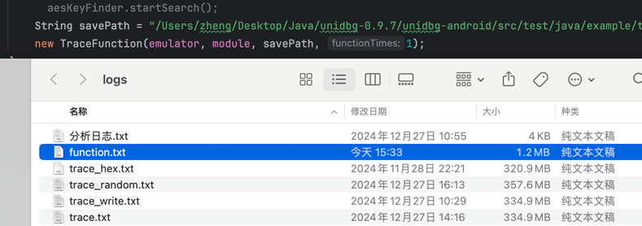
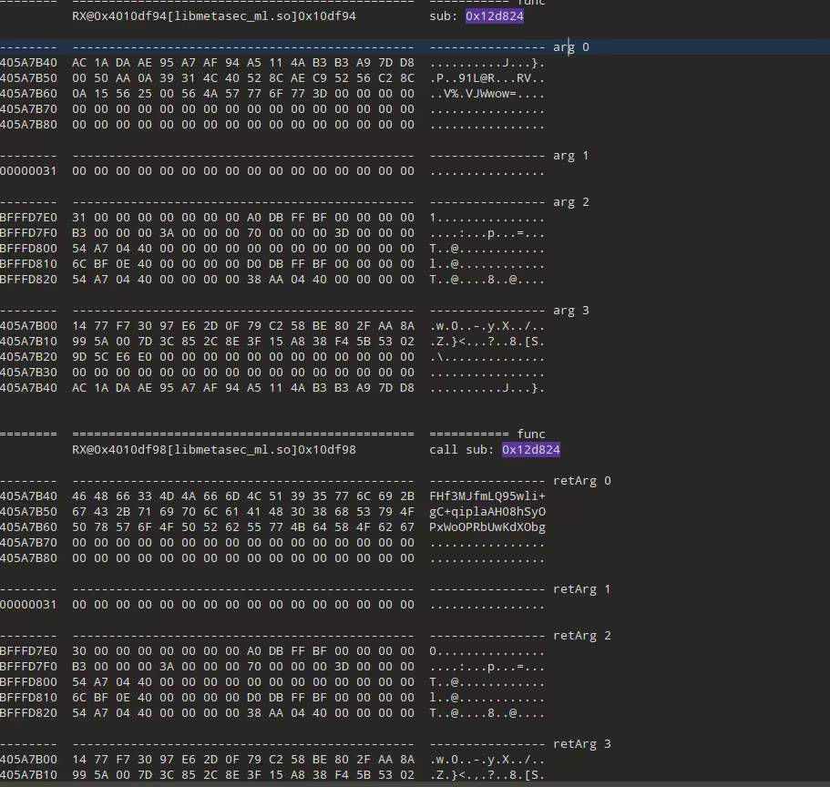
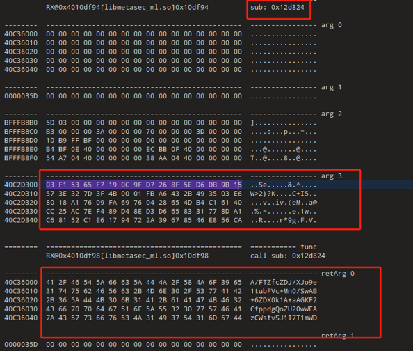
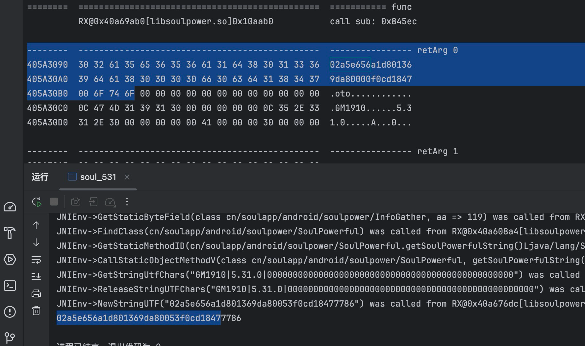
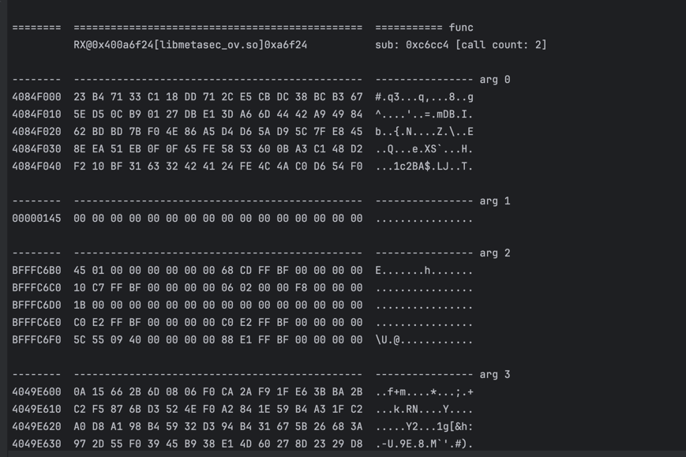

# 需要在unidbg的环境下使用 ！！！

## 作用

* 只关心函数调用，函数执行后参数变化情况
* 可以快速定位参数，输出是文本格式，可以用任意文本编辑器打开
* 可以脱出很多有用有价值的信息，帮助快速定位
* 同时记录了所在的内存地址，方便使用traceWrite/Read 跟踪定位
* 现版本的加了函数执行计数，在一个函数多次执行的时候，可以快速定位轮数
* java不是很熟练，有不合理的地方，请自行修改源码


### 更新
* 参数注释说明（ 类名下
* 函数调用过滤，防止函数调用次数过多，导致日志太多，trace效率极低

## 用法
### 在unidbg初始化时加入
``` text
new TraceFunction(emulator, module, savePath);
```
## 更新
### 加了过滤

### 完整日志


## 效果






### 最新的改动


## 日志说明
#### 函数调用
```text
========  ===========================  函数分割线
          执行函数的指令地址              sub：函数地址  [call count: 调用次数]
          
--------  ---------------------------  函数入参
内存地址                                

```
#### 函数返回
```text
========  ===========================  函数分割线
          执行函数的指令地址              call sub：返回的函数地址
          
--------  ---------------------------  函数反参 （也就是入参）
内存地址                                
--------  ---------------------------  retValue （函数返回值）
```